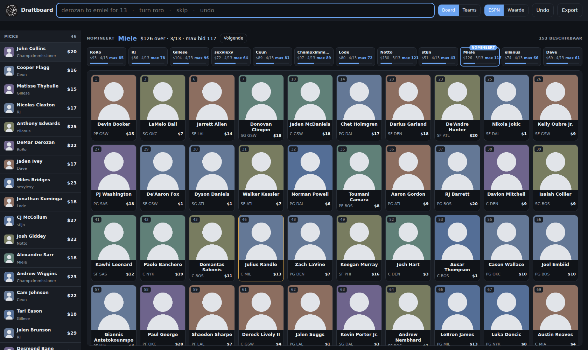
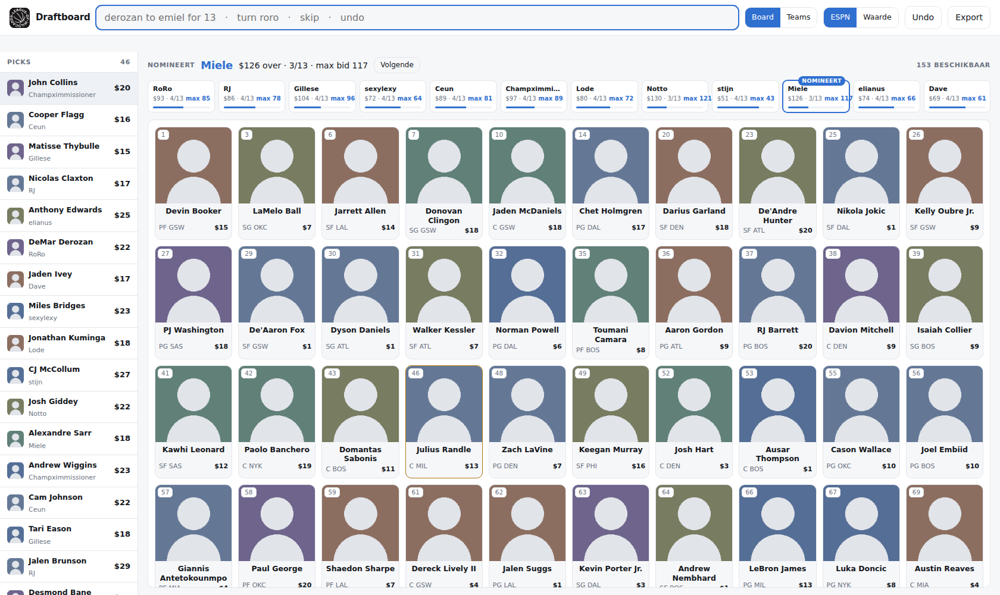
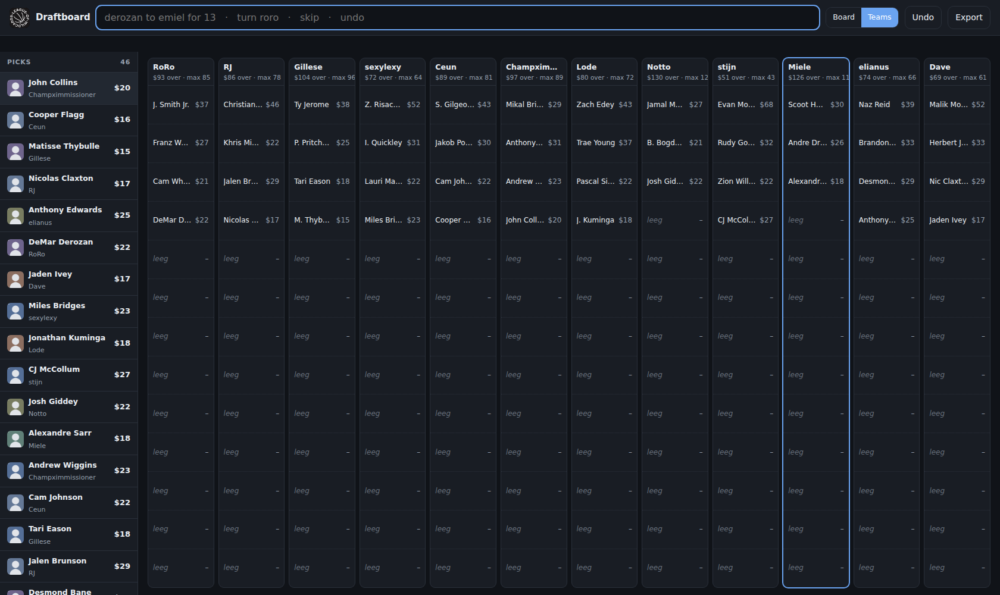
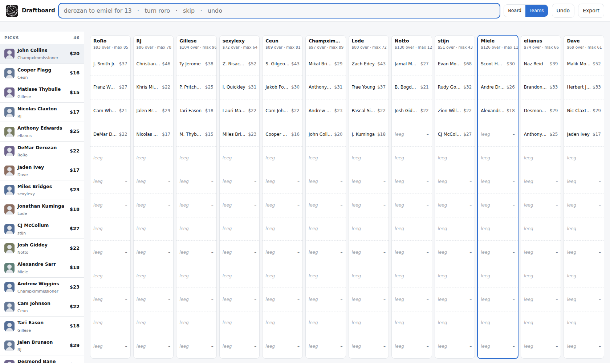

# League of Wildcards Draftboard

## Functional requirements, fase 1

Versie 0.1, 22 september 2026. Status: fase 1 gebouwd en getest op gesimuleerde
data, nog niet op een echte draft gedraaid.

---

## 1. Context

League of Wildcards is een fantasy basketball league van twaalf managers die al
negen jaar draait. De draft is een auction die offline in een zaal gebeurt, met
één persoon die de picks in een gedeelde Google Sheet typt. Waardebepaling
gebeurde tot nu toe in een Excel-tool met Z-scores per categorie en een eigen
omrekening naar dollarwaardes.

Drie problemen met die werkwijze:

1. **Data verzamelen.** Bronnen vinden met bruikbare projecties kost elk jaar veel
   handmatig zoek- en downloadwerk, en niet elke bron geeft de volumestats die
   nodig zijn om FG% en FT% correct te waarderen.
2. **Omvormen.** Elke bron heeft een eigen formaat en moet met knip- en plakwerk
   in het sheet passen zonder de formules te breken.
3. **De draft zelf.** Bijhouden wie al weg is, wat elk team nog kan bieden en of
   een prijs redelijk is, gebeurt volledig met de hand terwijl er geboden wordt.

Fase 1 lost het derde probleem op en automatiseert het eerste en tweede
grotendeels.

## 2. Scope

**In scope (fase 1).** Eén publieke webapp met twee views, dezelfde voor iedereen:
een draftboard met beschikbare spelers en een rosteroverzicht. Invoer via een
commandobalk. Automatische waardebepaling uit opgehaalde projecties.

**Uit scope (fase 2).** Logins, een eigen teampagina per manager waarop het eigen
team invult, categorietotalen en -rangen per team, biedadvies, en de optimizer
die punt-builds doorrekent.

**Uit scope (later).** Spraakbediening. De architectuur is er wel op voorbereid,
zie F-30.

## 3. League-parameters

| Parameter | Waarde |
|---|---|
| Teams | 12 |
| Formaat | Head to head, 8 categorieën |
| Categorieën | PTS, 3PM, REB, AST, STL, BLK, FG%, FT% |
| Turnovers | Tellen niet mee |
| Drafttype | Auction |
| Budget per team | $200 |
| Rosterplekken | 13 |
| Totale pot | $2400 |
| Gedrafte spelers | 156 |

Alle parameters staan in `config.json` en zijn aanpasbaar zonder codewijziging.
De league speelde tot en met 2021 met veertien teams, dus de parameters mogen
niet hardgecodeerd zijn.

## 4. Gebruikers

| Rol | Fase | Beschrijving |
|---|---|---|
| Invoerder | 1 | Typt de picks in tijdens de draft. Eén persoon. |
| Kijker | 1 | Iedereen in de zaal kijkt mee op een gedeeld scherm of een eigen laptop. Alleen lezen. |
| Manager | 2 | Logt in en beheert de eigen teampagina. |

In fase 1 is er geen authenticatie. Iedereen die de app opent ziet hetzelfde en
kan in principe invoeren. Dat is bewust: de draft gebeurt in dezelfde ruimte en
sociale controle volstaat.

---

## 5. Functionele eisen

### 5.1 Data en waardebepaling

**F-1.** Het systeem haalt seizoensprojecties op bij ESPN via
`lm-api-reads.fantasy.espn.com/apis/v3/games/fba/seasons/{season}/segments/0/leaguedefaults/3?view=kona_player_info`,
zonder login. Statline `10{season}` (`statSourceId` 1, `statSplitTypeId` 0) bevat
de seizoenstotalen, met MPG en GP apart.

**F-2.** De publieke `/players`-route van ESPN geeft maximaal 50 spelers
alfabetisch en negeert de filter-header. Het systeem gebruikt daarom de
leaguedefaults-route, die `x-fantasy-filter` wel respecteert.

**F-3.** Het systeem leest per speler minstens: GP, MPG, PTS, REB, AST, STL, BLK,
TO, FGM, FGA, FTM, FTA, 3PM, 3PA, positie, team, blessurestatus, ADP en de
gemiddelde auctionwaarde van de bron.

**F-4.** Bronnen die alleen percentages geven zonder pogingen worden aangevuld.
Met FTM bekend volgt FGM uit `PTS = 2*FGM + 3PM + FTM` en `FGA = FGM / FG%`.
Zonder FTM levert de FTA/FGA-verhouding van de ankerbron
`FGA = (PTS - 3PM) / (2*FG% + r*FT%)`. De uitvoer rapporteert per rij of de
attempts uit de bron kwamen, afgeleid zijn of geschat.

**F-5.** Meerdere bronnen worden samengevoegd tot een consensus per speler, met
matching op genormaliseerde naam.

**F-6.** Per categorie wordt een Z-score berekend over de `z_pool` beste spelers
(standaard 180). De pool wordt in twee passes bepaald: eerst op speelminuten,
daarna opnieuw op de gevonden waarde, zodat de gemiddeldes komen van de spelers
die werkelijk gedraft worden.

**F-7.** FG% en FT% gaan als impactscore mee, namelijk
`(percentage - poolgemiddelde) x pogingen`, en niet als het percentage zelf. Een
FT% van 95 op één poging per wedstrijd is daardoor nagenoeg waardeloos.

**F-8.** Categorieën zijn per stuk aan of uit te zetten en te wegen via
`config.json`, zodat punt-builds doorgerekend kunnen worden.

**F-9.** De omrekening van Z naar dollars is zelfconsistent: elk van de 156
gedrafte spelers kost minstens $1, het restant van de pot wordt verdeeld over het
surplus boven replacement level (de speler die net buiten de draft valt). De som
van alle waardes is exact de pot.

**F-10.** Bij twee of meer bronnen wordt de spreiding per stat over de bronnen
berekend en als onzekerheid getoond. Bij één bron bestaat die spreiding niet; dan
toont het systeem een risicoproxy op basis van geprojecteerde wedstrijden en
blessurestatus, expliciet gelabeld als proxy (`risk_basis`).

**F-11.** De pipeline levert ook een plakblok in de kolomvolgorde van de
bestaande Excel-tool, zodat die als vangnet blijft werken.

**F-12.** Marktprijzen (ADP en auctionwaardes) worden als aparte module met een
eigen ververscadans opgehaald, los van de projecties, en vlak voor de draft
opnieuw. Eind september zijn die cijfers nog dun omdat er weinig gedraft is.
*(Nog te bouwen.)*

### 5.2 Draftboard, view 1

**F-13.** Het board toont alle nog beschikbare spelers als kaarten met foto, naam,
positie, NBA-team en de berekende dollarwaarde.

**F-14.** **Foto's komen van ESPN**, op
`https://a.espncdn.com/i/headshots/nba/players/full/{espn_player_id}.png`. De
speler-ID uit de ESPN-projectiepull is meteen de sleutel voor de foto.

**F-15.** Foto's worden in drie stappen geladen: eerst de lokaal gecachte kopie op
`/headshots/{id}.png`, dan rechtstreeks de ESPN-CDN, en pas als beide falen de
initialen van de speler. Een apart script haalt de foto's vooraf binnen, zodat het
board werkt in een zaal zonder bruikbare wifi.

**F-16.** De standaardvolgorde is de ESPN-rangorde, omdat de league het seizoen op
ESPN speelt en die volgorde ook de waivercontext bepaalt. Sorteren op eigen
berekende waarde is één klik.

**F-17.** Een gedrafte speler verdwijnt van het board. De kaart faded eerst weg
voor de lijst hertekent, zodat zichtbaar is wie eruit gaat.

**F-18.** Het rangnummer op de kaart blijft de oorspronkelijke ESPN-rang. Er
ontstaan dus gaten in de nummering naarmate de draft vordert, wat direct laat
zien hoeveel hoog gerangschikte spelers al weg zijn.

**F-19.** Er is een alternatieve lijstweergave met dezelfde spelers en meer
kolommen: waarde, marktwaarde, ADP, z-totaal en risico.

**F-20.** Een balk bovenaan toont welk team aan de beurt is om te nomineren, met
het resterende budget en de max bid van dat team.

**F-21.** Een strip toont voor alle twaalf teams het resterende budget, het aantal
gevulde plekken en de max bid. Het nominerende team is gemarkeerd.

**F-22.** Max bid is het resterende budget min één dollar per nog te vullen
rosterplek. Dat is wat een team werkelijk kan uitgeven aan de volgende speler.

### 5.3 Rosters, view 2

**F-23.** Een overzicht van twaalf kolommen naast elkaar met dertien rijen per
kolom, prijs naast naam, in dezelfde vorm als de draftsheets van de vorige jaren.

**F-24.** Het overzicht past in één scherm zonder scrollen. De rijen delen de
beschikbare hoogte.

**F-25.** Per kolom staan de teamnaam, het resterende budget en de max bid.

**F-26.** Namen die te lang zijn voor de kolom worden ingekort tot voorletter plus
achternaam. De volledige naam staat in de tooltip.

### 5.4 Pickhistorie

**F-27.** Een vaste kolom links toont de pickhistorie met de nieuwste pick
bovenaan, inclusief foto, spelersnaam, kopend team en prijs. De kolom is zichtbaar
op beide views.

**F-28.** De meest recente pick is visueel gemarkeerd.

### 5.5 Invoer

**F-29.** Picks worden ingevoerd via één commandobalk met een vaste grammatica:

```
<speler> to <team> for <bedrag>
<speler> mine <bedrag>
turn <team>
skip
undo
```

Bedragen mogen cijfers of Engelse getalwoorden zijn (`for thirteen`). Een
voorafgaand `draftbot` wordt genegeerd.

**F-30.** De grammatica is Engelstalig en de parser draait op de server, niet in
de browser. Reden: een enkel taalmodel herkent Engelse eigennamen merkbaar beter
dan een mengeling van Nederlandse structuurwoorden met Engelse spelersnamen, en
een serverparser laat straks zowel het toetsenbord als een spraaktranscriptie op
hetzelfde endpoint binnenkomen, onderscheiden door een `source`-veld. Er hoeft dan
niets gedupliceerd te worden.

**F-31.** Tijdens het typen filtert het board live mee op het naamdeel van het
commando, dus nog voor het volledige commando af is.

### 5.6 Naamherkenning

**F-32.** Er is geen vaste aliastabel. Bijnamen worden elk jaar geïmproviseerd en
zijn niet stabiel: over de jaren 2017 tot 2023 wijkt 39% van de 700 unieke
naamstrings af van "Voornaam Achternaam", met vormen als `Wembie`, `BroLo`,
`Domme Ayton`, `Wussel Restbrook`, `Greek freek` en `MAGA Porter Jr.`.

**F-33.** In plaats daarvan scoort elke kandidaat op bigram-overlap met de
volledige naam en met de achternaam apart, met een bonus voor een prefixtreffer
en soundex als vangnet voor schrijf- en spraakfouten.

**F-34.** Er wordt uitsluitend gezocht in de nog beschikbare spelers. Dat lost de
meeste ambiguïteit vanzelf op, omdat een speler maar één keer gedraft kan worden:
zodra Mikal weg is, is "bridges" Miles.

**F-35.** Bij een score onder de drempel of bij twee dicht bij elkaar liggende
kandidaten gokt het systeem niet, maar toont het de kandidaten met hun score. Eén
klik bevestigt.

**F-36.** Een al gedrafte speler wordt geweigerd met een melding, net als een team
dat al dertien spelers heeft.

Getest gedrag: `jokitch` vindt Jokic, `de rosan` vindt DeRozan, `sengun` vindt
Alperen Sengun, `bridges` vraagt welke van de twee.

### 5.7 Beurtvolgorde

**F-37.** Het systeem houdt bij welk team aan de beurt is om te nomineren en
schuift automatisch door na elke pick.

**F-38.** Teams met een volle roster worden overgeslagen.

**F-39.** `undo` zet de beurt mee terug.

**F-40.** De beurt is handmatig te zetten (`turn <team>`) of door te schuiven
(`skip`), omdat de volgorde in de zaal in de praktijk afwijkt.

**F-41.** De nominatievolgorde is instelbaar en hoeft niet gelijk te zijn aan de
volgorde waarin de teams getoond worden.

### 5.8 Meerdere schermen

**F-42.** Beide views hebben een eigen URL (`/board` en `/teams`) en kunnen dus in
twee browservensters op twee schermen open staan.

**F-43.** Elke geopende view pollt de server elke 3 seconden en loopt daardoor
vanzelf gelijk met de rest. Er is geen handmatige verversing nodig.

**F-44.** De server is de enige bron van waarheid. Alle clients renderen de
state die de server teruggeeft.

### 5.9 Persistentie en export

**F-45.** De draftstand staat in SQLite, niet in browseropslag. Daardoor overleeft
de stand een herstart van de app of de browser midden in de draft.

**F-46.** De volledige stand is als JSON te exporteren.

**F-47.** Elke pick legt vast: speler-ID, naam, team, prijs, invoerbron en
tijdstip. Daardoor is de draft achteraf een schone dataset zonder parsewerk, en
bruikbaar als prijsmodel voor volgend jaar.

---

## 6. Niet-functionele eisen

**N-1. Betrouwbaarheid boven functies.** De app moet op draftavond werken. Elke
functie heeft een handmatige terugvaloptie: naast een commando kan gefilterd en
geklikt worden, en `undo` corrigeert elke fout.

**N-2. Werkt zonder internet.** Na het vooraf ophalen van projecties en foto's
draait de app volledig lokaal. De enige externe afhankelijkheid tijdens de draft
zijn de foto's, en die vallen terug op de lokale cache en daarna op initialen.

**N-3. Netwerkbeperking.** De bedrijfsproxy van de gebruiker blokkeert ESPN,
FantasyPros, Yahoo, stats.nba.com en a.espncdn.com met een 403 op CONNECT, zowel
vanuit de cloudomgeving als vanuit de desktop-VM. Alle ophaalscripts draaien
daarom op de eigen machine van de gebruiker.

**N-4. Geen installatiedrempel voor de ophaalscripts.** `fetch_espn.py`,
`fetch_headshots.py` en `build_values.py` gebruiken alleen de Python standard
library. Alleen de webapp zelf vraagt dependencies.

**N-5. Deployeerbaar.** De app is een gewone ASGI-applicatie achter uvicorn. Voor
een latere deploy volstaat een container met `LOW_DB` naar een volume. Er zit
niets machinegebonden in de code.

**N-6. Leesbaar op afstand.** De pagina scrollt zelf niet. Elk paneel scrollt
apart, zodat de beurtbalk en de budgetten altijd in beeld blijven op een gedeeld
scherm.

**N-7. Donker en licht.** De interface volgt de systeemvoorkeur.

**N-8. Geen paywall omzeilen.** Alleen publiek toegankelijke bronnen. Razzball
staat achter een bot-check en wordt daarom niet automatisch opgehaald.

---

## 7. Databronnen

| Bron | Toegang | Volumestats | Rol |
|---|---|---|---|
| ESPN fantasy API | Publiek, geen login | FGM/FGA/FTM/FTA aanwezig | Primaire projectiebron, speler-ID's, ADP, auctionwaarde, **foto's** |
| FantasyPros | Publiek, geen login | Alleen percentages | Tweede projectiebron, attempts worden gereconstrueerd |
| Yahoo draftanalysis | Publieke pagina | n.v.t. | ADP, met Preseason, All Drafts en Last 7 Days apart. De Fantasy-API zelf ligt eruit sinds juli 2026 |
| stats.nba.com | Publiek | Actuals | Anker voor de reconstructie van attempts |
| Eigen draftgeschiedenis | Lokaal bestand | n.v.t. | 1456 werkelijk betaalde prijzen over negen jaar, als prijsmodel voor deze twaalf managers |
| Hashtag Basketball | $2,50/maand | Attempts ingebed in de FG%-cel | Optionele tweede attempts-bron |
| Basketball Monster | $69,95 | Volledig | Alternatief als zelfbouw niet volstaat |
| Rotowire, DARKO, Razzball | Paywall, niet live, bot-check | | Niet bruikbaar |

## 8. Architectuur

```
app/
  main.py        API en statische frontend (FastAPI)
  draft.py       spelerspool, picks, budgetten, beurt, SQLite
  matching.py    naam-matching en commandoparser
  static/        index.html, app.css, app.js, logo.png
tool/
  fetch_espn.py       projecties ophalen
  build_values.py     Z-scores en auction-waardes
  fetch_headshots.py  ESPN-foto's lokaal cachen
  parse_history.py    draftgeschiedenis uitlezen
data/            bronbestanden, draft.db, headshots
output/          values.json, paste_block.csv, top.txt
```

### API

| Route | Doel |
|---|---|
| `GET /board`, `GET /teams` | de twee views, zelfde pagina |
| `GET /api/players` | spelerspool met waardes, ESPN-volgorde, foto-ID |
| `GET /api/state` | budgetten, max bids, picks, rosters, beurt |
| `POST /api/command` | `{text, source}` vrij commando door de parser |
| `POST /api/pick` | `{player_id, team, price}` bevestigde keuze |
| `POST /api/undo` | laatste pick terug |
| `POST /api/turn` | beurt zetten of doorschuiven |
| `POST /api/settings` | teams, nominatievolgorde |
| `GET /api/export` | volledige stand als JSON |

---

## 9. Ontwerp

Beide beelden komen uit de draaiende applicatie met 46 gesimuleerde picks. De
spelersnamen zijn echt en komen uit de eigen draftgeschiedenis. De statistieken en
dollarwaardes erachter zijn gegenereerd. De foto's zijn grijze placeholders omdat
de testomgeving `a.espncdn.com` niet mag bereiken; **in productie komen de foto's
van ESPN**, zie F-14 en F-15.

### View 1: draftboard



Van links naar rechts: pickhistorie met de nieuwste bovenaan, dan de beurtbalk met
het nominerende team, de budgetstrip van alle twaalf teams, en het bord met
beschikbare spelers in ESPN-volgorde.



### View 2: rosters



Twaalf kolommen van dertien plekken, in de vorm van de draftsheets van de vorige
jaren, passend in één scherm.



---

## 10. Openstaande punten

| Punt | Opmerking |
|---|---|
| Marktprijsmodule | ADP en auctionwaardes uit meerdere bronnen, herschaald naar 12 teams / $200 / 13 plekken voor ze gemiddeld worden. Vlak voor de draft te draaien. |
| Tweede projectiebron | Nodig om de risicokolom op bronspreiding te baseren in plaats van op de huidige proxy. |
| Prijsmodel op eigen historiek | Negen jaar aan werkelijk betaalde prijzen van dezelfde managers, om de inflatiecurve en het sterrenpremie-effect van deze league te schatten. |
| Positieslots | De rosterslots per positie zijn nog niet vastgelegd; nu zijn het dertien vrije plekken. |
| Spraaklaag | Lokale Whisper die transcripties naar `POST /api/command` stuurt. Vraagt een test op echte spelersnamen in zaalgeluid voor er op gebouwd wordt. |
| Optimizer | MILP over de spelerspool met budget- en rosterrestricties, plus Monte Carlo over de onzekerheid. Fase 2. |
| Fase 2 | Logins, eigen teampagina per manager, categorietotalen en biedadvies. |
